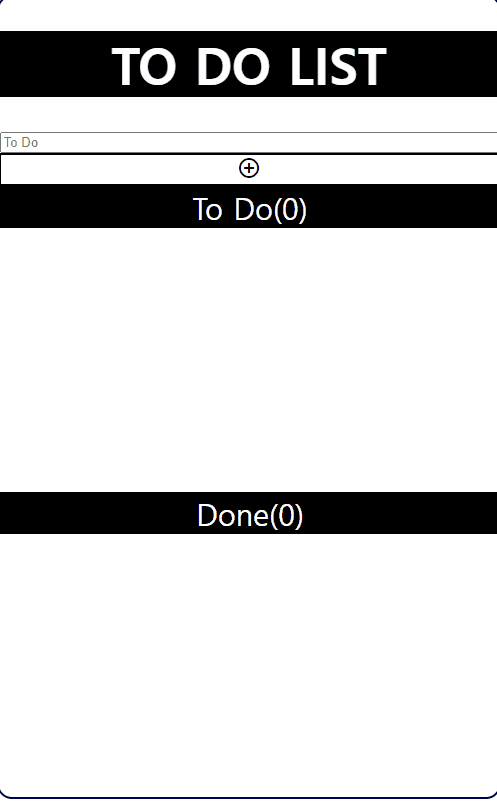
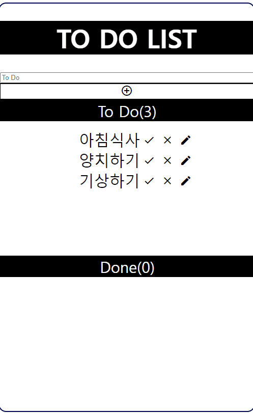
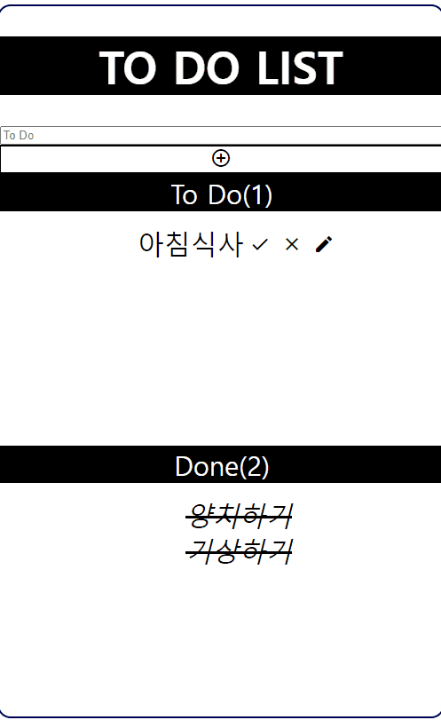
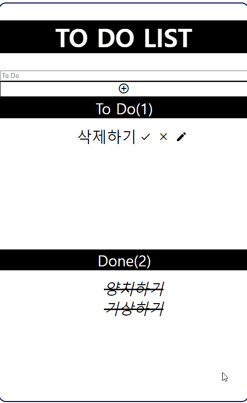

# To Do List

#### 리액트를 이용하여 만든 to do list 
 할 일을 입력하여 리스트에 등록하고, 수정,삭제하고 일을 완료했으면 완료목록에 할 일을 표시합니다.

- #### To Do 입력하기
</img>
- #### To Done 하기
</img>
- #### To Do 수정하기
</img>
- #### To Do 삭제하기
</img>

### 후기
#### 리액트를 접하고 처음으로 혼자 만들어 본 ToDoList 

useState에서 state를 정수,문자,boolean으로만 사용해봤는데, 처음으로 객체를 사용해봤고, 리액트 사용법외에도 리액트 관련 정보를 찾는 법도 알게된 것 같다.
=======
# todoList

To Do List 필요한 태그 button,input,,ul,li,div object 를 만들어 문자열 입력값,key 값이 될 정수형, 완료유무를 확인할 boolean 값을 넣는다. 입력 받은 값은 useState를 이용

입력된 값을 보여줄 배열에는 문자열 입력값만 넣어서 출력 입력된 값 옆에는 수정,완료,삭제를 할 수 있는 버튼

완료버튼을 만드는 데 문제가 생겼다. 배열에 문자열만 넣어서 배열안에 있는 값을 활용하여 완료 여부를 확인 할 수 가 없다. 수정과 삭제버튼은 완성

**
-----
완료 boolean을 따로 useState로 만들어서 시도 출력하는 배열에 object를 담고 출력은 object안에 입력 값만 출력 배열에 obj를 담으니 다른 부분에서 문제가 생긴다.

 done list를 만들어 완료 버튼을 클릭하면 해당 문자열을 donelist로 보내는 것으로 수정

22/06/23
----
지금 생각해보니 UseContext같은 방법을 이용하면 될 것 같다.
>>>>>>> 415966a9d720aa335a586dea74bb504d6c29a0dc
